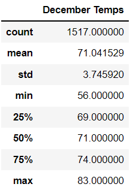
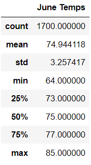
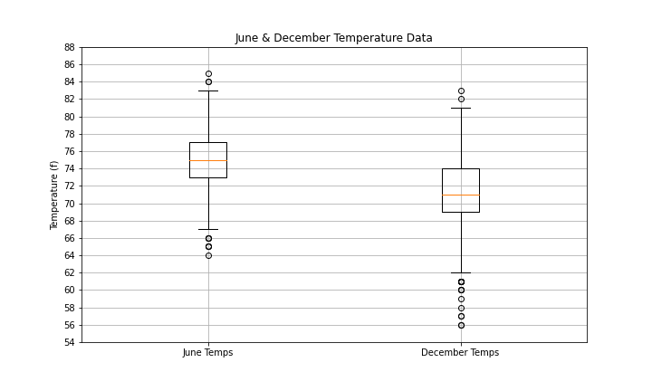

# Surfs Up

## Project Overview

### Purpose
To open a Surf’n’Shake shop, a shop that sells surf boards and ice cream in Oahu, Hawaii, the weather has to be in our favor most of the year. A perfect spot for the shop is a place with the right balance of warm temperatures, sunny days throughout the year and just enough rain to keep the vegetation green. If that criteria is met, we can be confident that new shop will be successful. To ensure that we will choose the right spot, we must make data-driven decisions. This analysis focuses on the temperature and rainfall for the past 7 years from 2010 to 2017, specifically for June and December, to determine if the surf and ice cream shop business is sustainable year-round. In order to have enough data, I am analyzing data from six weather stations in Oahu, Hawaii. 

The analysis consists of two parts:
- Temperature analysis for June and December from 2010 to 2017.
- Rainfall analysis for June and December from 2010 to 2017.

Resources
Data Source:
- hawaii.sqlite

Environment:
- Python 3.7

Dependencies
Please see full list of dependencies here

Software:
- Jupyter Notebook
- SQLite

## Results
The analysis focuses on the temperature and rainfall from six different weather stations on Oahu, Hawaii from 2010 to 2017 for June and December. The data collected presented a pretty ideal location for a year-round surf-and-ice cream business.

### Comparison of the Temperatures for June and December
1. Count of Data
 - There is less data for December (1517 data points) than for June (1700 data points).

2. Std Deviation, Median, Mean, Min & Max
- Temperatures are more spread out in December (std = 3.7) than in June (std = 3.3).
- June’s mean and median are 74.94 °F and 75.00 °F respectively.
- December’s mean and median are 71.04 °F and 71.0 °F respectively.
- Maximum temperature in December is 83 °F and in June is 85 °F.
- Minimum temperature in December is 56 °F and in June is 64 °F.

3. Quartiles
- 1st quartile: 25% of all data is below 69 °F in December and 73 °F in June.
- 3rd quartile 75% of all data is below 74 °F in December and 77 °F in June.

 

Summary Statistics of Temperatures for December and June in Oahu, Hawaii. 

### Comparison of the Rainfall for June and December
1. Count of data
- There is less data for December (1405 data points) than for June (1574 data points).

2. Std Deviation, Median, Mean, Min & Max
- Rainfall quantity is more spread out in December (std = 0.5) than in June (std = 0.33).
- June’s mean and median are 0.13 inches and 0.02 inches respectively.
- December’s mean and median are 0.21 inches and 0.03 inches respectively.
- Maximum rainfall in December is 6.42 inches and 4.43 inches in June.
- Minimum rainfall in December is 0 inches and 0 inches in June.

3. Quartiles
- 1st quartile: 25% of all data is at 0 inches in December and 0 inches in June.
- 3rd quartile 75% of all data is below 0.15 inches in December and 0.12 inches in June.

## Summary
### Temperatures for June and December
From the temperature report we can see that there is not much difference in the weather in June and December, indicating mild and steady temperatures year-round. Mean and median – also known as 2nd quartile - are closely together, meaning that distribution of the data is not spread out. To find out protentional outliers and other trends, the box and whisker chart can tell us more about that.

Summary Statistics of Temperatures for December and June in Oahu, Hawaii. 

Box and Whisker Plot of Temperatures for December and June in Oahu, Hawaii.

From the graph we can see that there are just a few outliers. There are more outliers below the lower boundary in December, however the minimum temperature is 56 °F.
